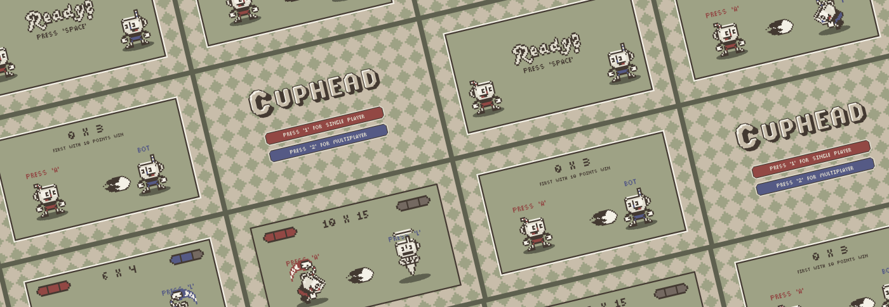
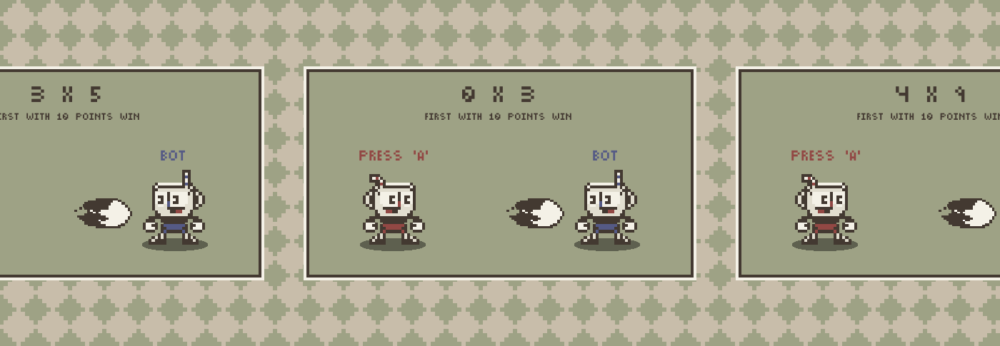
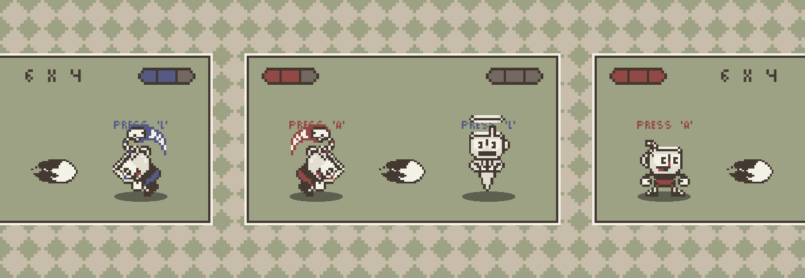

# Cuphead Game

## Sobre

É um curto jogo inspirado no famoso Cuphead que envolve um mecanismo de ataque da dupla protagonista do jogo original, constituído por dois modos de jogo, um __single player__ e um modo __multiplayer__, sendo que ambos divergem na mecânica de ganhar ou perder.

"Cuphead" é um projeto pessoal utilizado como meio de estudo e prática na criação de funções e manipulação da máquina de estados finitos.

## Mecânica

No __single player__, um dos personagens é um bot e ele ataca em um tempo aleatório, sendo o outro controlado por uma interação por parte do usuário. Ao atacar nos frames que o inimigo está ao lado do personagem correspodente, é adicionado 1 ponto, e então, o primeiro a atingir 10 pontos ganha.

Já no __multiplayer__, os dois personagens são controlados por uma interação por parte dos usuários, seguindo a mesma ideia de ganhar pontos ao atacar nos frames corretos, mas com o acréscimo de vidas. Cada personagem inicia com 3 vidas, mas ao atacar e errar o frame, ele perde uma vida, e ao acabar as 3, ele morre e o jogo encerra. Nesse caso, a quantidade de pontos é infinita.

Em ambos os casos, ao longo que se acumula pontos, o inimigo se movimenta mais rápido.

## Ferramentas Utilizadas

- [p5.js]("https://p5js.org/")
- [Figma]("https://www.figma.com/")
- [Pixilart]("https://www.pixilart.com/")
